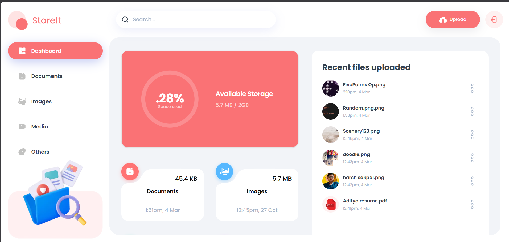
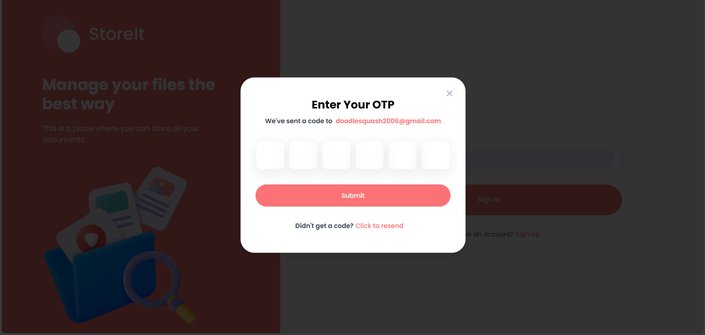
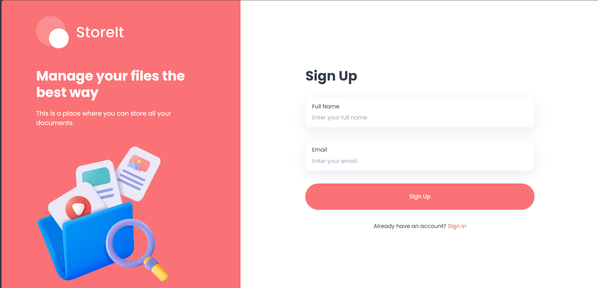
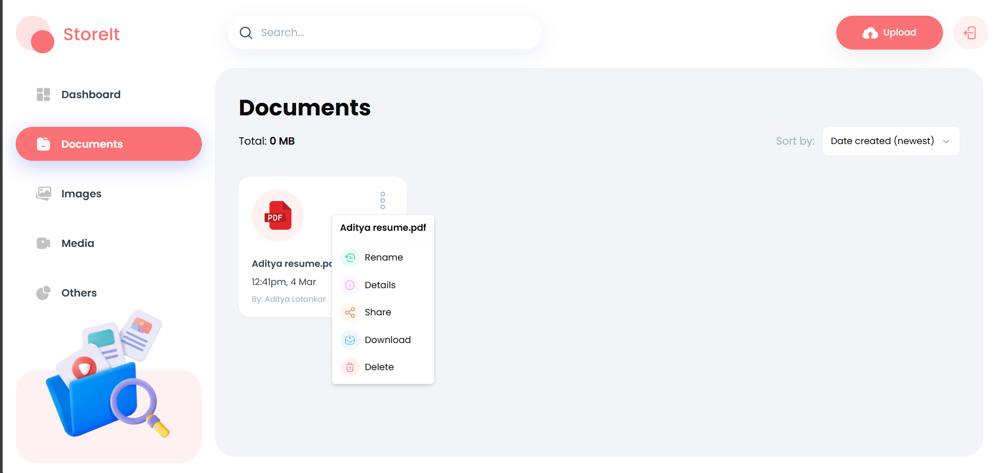

# ☁️ **Store It – Cloud Storage App**

[](https://store-it-aditya.vercel.app/sign-in)


Store It is a modern cloud storage platform designed to provide a secure and seamless online file management experience. Users can upload, organize, and share documents, images, and media files, while the platform ensures passwordless OTP authentication, real-time updates, and an elegant visual representation of storage utilization.

---

## 🚀 **Features**

- 🔐 **Passwordless OTP Authentication** – Secure, seamless session creation using time-based one-time passcodes sent directly to your email.
- 📁 **File Management** – Upload, preview, rename, and delete files effortlessly. Supports file sizes up to 50MB.
- 🔗 **Secure Sharing** – Invite collaborators or share files with other users by entering their email address.
- 📊 **Storage Analytics** – Interactive dashboard visualization highlighting storage space usage divided by category (Documents, Images, Media, Others).
- ⚡ **Real-Time Updates** – Instantly sync file uploads, deletions, and updates using Appwrite database subscriptions.
- 📱 **Responsive UI** – Optimally designed to look stunning and perform smoothly across both mobile and desktop viewports.

---

## 🛠️ **Tech Stack**

- **Frontend:** Next.js 15, Tailwind CSS
- **Backend:** Appwrite (Database, Storage Buckets, Auth)
- **Type Safety:** TypeScript

---

## 🌍 **Deployment**

The application is deployed and accessible online:

- **User Platform:** [View Live](https://store-it-aditya.vercel.app/sign-in)

---

## 📌 **Installation & Setup**

```bash
# 1. Clone the repository
git clone https://github.com/DoodleSquash/store-it.git
cd store-it

# 2. Install dependencies
npm install
```

### **3. Set Up Environment Variables**
Create a `.env.local` file in the root directory:
```env
NEXT_PUBLIC_APPWRITE_ENDPOINT=https://cloud.appwrite.io/v1
NEXT_PUBLIC_APPWRITE_PROJECT=your_project_id
NEXT_PUBLIC_APPWRITE_DATABASE=your_database_id
NEXT_PUBLIC_APPWRITE_FILES_COLLECTION=your_files_collection_id
NEXT_PUBLIC_APPWRITE_USERS_COLLECTION=your_users_collection_id
NEXT_PUBLIC_APPWRITE_BUCKET=your_storage_bucket_id
NEXT_APPWRITE_KEY=your_secret_api_key
```
> [!TIP]
> **Appwrite Console Setup:** Double-check that your CORS permissions are set up correctly on your Appwrite project settings so that your local dev environment can fetch the API endpoints.

### **4. Start Local Development**
Run the following command to spin up the local development server:
```bash
npm run dev
```
App will be running at http://localhost:3000.

---

## 🖼️ **Interface Preview**

### Core Storage & Onboarding
| **Dashboard Overview** | **OTP Verification** |
| :---: | :---: |
|  |  |

### Authentication & Operations
| **Sign Up** | **File Operations** |
| :---: | :---: |
|  |  |

---

## 🛠️ **Contributing**

Contributions are welcome! Feel free to fork the repository, create a new branch, and submit a pull request.

---

### 💡 **Feedback & Support**

For any issues or suggestions, feel free to open an issue on GitHub or contact me at [adityalotankar06@gmail.com](mailto:adityalotankar06@gmail.com).
